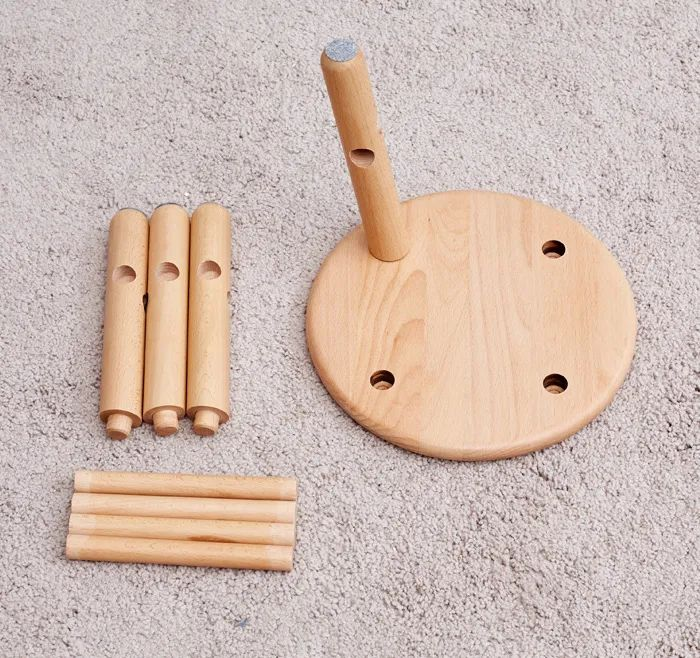
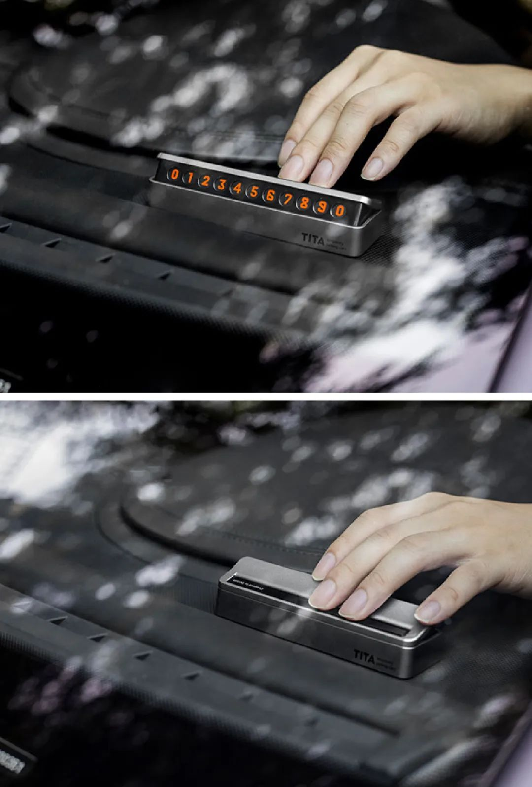

今天的推送标题，乍一看似乎有些离谱，但却十分精准地表达了今天的推荐主题。

91 年出生的我成长于科技、互联网都不那么发达的世纪之交，对于一些复古的、老派的、带有机械感的东西，我总是抱有极大的好感——**或者说怀念。**

比如，播放器按下按钮、磁带呲呲地旋转，钟摆滴答滴答左右摇晃，相机按下快门咔嚓一声定格时间，噼里啪啦地拍打游戏机按键……类似这样藏在我记忆深处的声音，偶尔会突然造访，唤醒我对那个年代的陈旧记忆。

▲ 图片来源：B 站 up 主 @HOPICO

标题里用了一堆象声词，也正是这个原因。

怀旧的想法多了，对老派物件的关注自然也多了起来。今天要和大家分享的，便是 **8 件机械感很强、带有浓厚复古意味**的“老东西”。它们有的实用、有的有趣，即便抛弃功能作为装饰品，也是极有魅力的存在。

它们身上的某些特质，或许还会勾起一些你对过往的回忆，希望有你喜欢的。

▲ 店铺名：源氏木语家居旗舰店

https://m.tb.cn/h.fz3RsLs?tk=Hb472tnxLXT

复制淘口令打开手淘，或粘贴链接到浏览器购买

二十多年前，在我还是一个小朋友的时候，家里发生过一件叫“打家具”的大事儿。

**打家具，其实就是做家具。**大人们去木材商那里定好木头，再请几个手艺熟练的木匠在家里住上一周，切割、组合、拼接、刷漆，新的衣柜、桌椅、板凳、茶几就做好了。

▲ 图片来源：unsplash

我对当时家里的一只小板凳印象最深刻。那时候上幼儿园，学校只提供桌子，凳子都是自己从家里搬过去的。**我见证了自己的小板凳从木头到家具的蜕变过程，**如今想来这是蛮有趣的回忆。

这样的经历如今是不大可能复制了，但如果家里需要小板凳，买一只可以自己组装的、全榫卯结构的木头凳子也是不错的替代。有小朋友的话，还能带着 Ta 感受一把榫卯结构的神奇。

源氏木语这只小凳子用的是北美橡木，有深、浅两种颜色可选，木材的花纹很漂亮，**而且没有任何人造板材、贴面，**就是纯纯的实木。木头表面做了细致的打磨和喷漆，光滑明亮，额外附赠一把安装用的小锤子、凳子腿防滑用的垫片。

小凳子是小朋友最朴实、最平凡的玩具，实木做成的小板凳耐用性也好，作为穿鞋凳是挺合适的选择。

🔗

https://m.tb.cn/h.fz3RsLs?tk=Hb472tnxLXT

复制淘口令打开淘宝，或粘贴链接到浏览器购买

▲ 店铺名：Film wharf 菲林码头

19￥HuI32tn0pok￥

https://m.tb.cn/h.fAbAt8b

复制淘口令打开手淘，或粘贴链接到浏览器购买

买一次性胶片相机尝鲜，是费力、费钱、麻烦、有风险，**却浪漫**的事儿。

一张胶卷只有一次成像机会，拍坏了就是浪费。胶卷拍完后需要冲洗，冲洗过程中也有损坏的可能。就不提闭眼睛、咧嘴这些表情管理没做到位产生的废片了，**怎么想，手机都比胶卷机方便一万倍。**

但总有人迷恋胶卷机的色彩质感、冲洗后拿在手里的真实感，以及按下快门咔擦一声的仪式感。虽然不方便，但相比拍摄一万张照片存到硬盘里，胶卷机可要浪漫和真实多了。如果你看过胶片相机浓重的滤镜风格带来的色彩，你应该也会爱上这样的画风。

推荐的这家店有柯达、vibe 等多个品牌的胶片相机，**最便宜的一款只要 79.5 元，内含 18 张胶卷。**拍摄完成后，可以寄回卖家那里进行冲洗和扫描，获得相片和电子档。**不同胶卷的冲洗、扫描费用不同，**建议大家在下单前找客服咨询清楚。

如果想省事儿，在手机上下载 NOMO、FIMO 等复古相机 App，拍摄后再找打印店打印出来，也是不错的复古办法。但如果你想找一个美好的午后，感受一把穿越级的复古体验，不妨买台胶片相机试一试。

▲ 图片来源：unsplash

对了，找卖家冲洗的话，记得让他把相机回寄给你，摆在书架上，或者拍照片时拿来做道具，都挺好。

🔗

19￥HuI32tn0pok￥

https://m.tb.cn/h.fAbAt8b

复制淘口令打开淘宝，或粘贴链接到浏览器购买

▲ 店铺名：欧森虎旗舰店

29￥elDc2tn0KHt￥

https://m.tb.cn/h.fAAUSVt

复制淘口令打开手淘，或粘贴链接到浏览器购买

这个小玩意儿虽然只要几十块，却充分展示出了一个“好设计”该有的样子。

它是个号码牌，设计师非常聪明地把它做成了“跷跷板”，按下一侧展示手机号，按下另一侧隐藏，简单、优雅又实用。

显示号码的那部分通过一个胶条固定，每一个数字都可以轻松随意地拆卸、排序。卖家还贴心地附赠了 6 组 0～9 的数字以及 6 个空白页，**世界范围内大部分格式的手机号，都能完美排列出来。**

它的底部是软性硅胶垫，既不会划伤汽车内饰，又能够稳稳地坐在车窗前。在我看来它唯一的缺点是有点好玩儿，我会忍不住一直开关开关，就像小时候玩儿真的跷跷板一样。

🔗

29￥elDc2tn0KHt￥

https://m.tb.cn/h.fAAUSVt

复制淘口令打开淘宝，或粘贴链接到浏览器购买

▲ 店铺名：ikbc 旗舰店

19￥kwzi2tnYRvA￥

https://m.tb.cn/h.fAAUQ5o

复制淘口令打开手淘，或粘贴链接到浏览器购买

我第一次用电脑，是小学时上**微机课**（这个词都自带 90 年代滤镜）。那时候在我们那儿，电脑是昂贵又稀罕的物件，学校对微机房极为重视，特地在教室门口增加了一层铁栅栏不说，每次上课前还要求我们戴好鞋套才能进门。上课过程中，大家对待电脑的方式也格外温柔，生怕出差错。

▲ 那会的电脑肯定没 Macintosh 那么老，但也新不到哪里去

后来，电脑进入百姓家，遍地都是黑网吧，这个曾经被我们小心翼翼使用的高级数码产品，地位直转急下，玩《劲舞团》时我恨不得把键盘给拍碎。等我再长大点回味起来，我才发觉了问题的关键：**并不是我不爱惜电脑，而是当时的键盘不行。**

其实最早的电脑，比如我上微机课时学校配的那些老款台式机，**用的都是机械键盘。**后来厂家为了让电脑快速普及、降低成本，键盘就变成了薄膜键盘，敲击起来软绵绵的，不拍打就没手感。

▲ 图片来源：unsplash

一直到几年前，我才终于重新用上了机械键盘。噼里啪啦爽脆的手感，不管是写稿还是玩游戏，都畅快了不少。之前我也推荐过几款机械键盘，但大多数价格都偏贵，这次就选了 ikbc 家性价比极高、颜值手感都在线的款式，**这个配色，复古气息也更足一些。**

它有蓝牙、2.4G 接收器、有线等多种连接方式，**建议大家买有线的就好，**稳定牢靠还不用充电。轴体可以选红轴，手感干脆利落，噪音也不大，在办公室也可以用。

这款键盘在发稿时暂时断货，大家可以先收藏。

🔗

19￥kwzi2tnYRvA￥

https://m.tb.cn/h.fAAUQ5o

复制淘口令打开淘宝，或粘贴链接到浏览器购买

▲ 店铺名：希山实验室

09￥jvI52tnYHAL￥

https://m.tb.cn/h.UaAOSHu

复制淘口令打开手淘，或粘贴链接到浏览器购买

2011 年我读大学，刚好赶上**优酷土豆**大火，拍视频的自媒体也刚开始出现。那会儿有一个叫 Techmessager 的博主，用极为精彩的文案和画面吸引了我，他的每一期视频我都必看。如今想来，我能成为数码家电编辑，一定有他一份功劳。

翻页钟，是我在他视频里种草的第一个小摆件。它不是传统的机械时钟，而是靠电池供电**。时间发生改变的方式，和球赛上的记分牌如出一辙。**分针、时针靠机械翻页变化，轻微的翻页声响，有趣的同时也不会打扰人。

翻页钟的主体材质为不锈钢，数字牌是 PVC，强度做得好，耐用性就有保证。家里的书桌上放一个当装饰品，高级感爆棚。

🔗

09￥jvI52tnYHAL￥

https://m.tb.cn/h.UaAOSHu

复制淘口令打开淘宝，或粘贴链接到浏览器购买

▲ 店铺名：wooderfullife 旗舰店

https://m.tb.cn/h.fzWodB0?tk=zSqk2tnX9kV

复制淘口令打开手淘，或粘贴链接到浏览器购买

八音盒，又是一个听名字就知道很复古的老物件。

小时候玩儿的八音盒，结构都比较简单，一般是台子上站一个芭蕾舞演员，上了发条后音乐响起，芭蕾舞演员会随着音乐旋转。

这款以猫咪为主题的八音盒做得就略复杂一些，主体为木质，上紧发条后，钢琴上的猫咪会旋转，旁边躺椅上的猫则会随着音乐摇晃。

除了猫咪，还有不同形态的八音盒可选，每一款对应的音乐也不同，都是比较知名的、有代表性的古典音乐曲子，大家可以挑自己喜欢的买。

🔗

https://m.tb.cn/h.fzWodB0?tk=zSqk2tnX9kV

复制淘口令打开淘宝，或粘贴链接到浏览器购买

▲ 店铺名：syitren 旗舰店

https://m.tb.cn/h.fAA6rFs?tk=BDGH2tnX8zW

复制淘口令打开手淘，或粘贴链接到浏览器购买

Syitren 家的 CD 机、黑胶唱机、蓝牙音箱一直很火，原因不外乎一个字：美。

但它家所有的产品里，我最喜欢的还是这台**原创设计**、风格独特、复古感又十足的 CD 机。

乳白色的机身，透明的 CD 盖，橙色的点缀装饰，圆角矩形的造型，点阵式音箱孔……这台机器的每一个细节都精准地打到了我的审美点上。4 个功能按键一字排开，硕大的音量调节旋钮，简洁明了，好看好用。

**但我最喜欢它的部分，是屏幕。**像 CD 机+蓝牙音箱这类功能简单的产品，一旦做了彩色的 LED 屏，观感就显得复杂。这款 CD 机用了和小时候的 MP3、掌上游戏机一样的黑白屏幕用以显示曲目、电量等必要信息，复古、简单、好看，是我喜欢的样子。

这是一台摆在哪里哪里就是风景的 CD 机，同时自带蓝牙音箱，颜值党和音乐爱好者双重狂喜。

🔗

https://m.tb.cn/h.fAA6rFs?tk=BDGH2tnX8zW

复制淘口令打开淘宝，或粘贴链接到浏览器购买

▲ 店铺名：睿初创意复古美学

58￥3ZnG2tn1HjC￥

https://m.tb.cn/h.fAAgrgD

复制淘口令打开手淘，或粘贴链接到浏览器购买

看到这款打字机，总让我想起两年前我在闲鱼上收的一台 iPad Classic。买回来两年多，我只用它听过 2 次歌。大部分时间里，除了充电，它就一直躺在我的电视柜上。我曾经想过要不要卖掉它，后来还是舍不得——**光是看到它我心情就会很好啊。**

打字机和我的 iPod 很像，它买回来有啥用？没用。这种完全复古的，甚至干脆就是中古旧物的老物件，就是没有实用性。打字机的结构注定了它不能打出汉字，只能在纸张上敲出一排英文字符，**写情书都费劲。**

▲ 打字机的文字效果

但浪漫、有趣、美好、情怀，这些令人产生愉悦情绪的字眼，常常隐藏在各种各样的“美丽废物”里，**美丽本身，就是最大的用处啊。**

所以，我把打字机放在了这篇文章最后做推荐。这是一台英雄牌打字机，大约生产于 80 年代，卖家搜集并清理、维修后，再进行售卖，可以保证打字功能可用，店里也有色带等耗材。

它完全靠机械结构驱动，键盘按下带动字符杆，用敲击的方式在纸上留下印痕。打字的感受很治愈，但同时也有点累手指。不实用，却好玩又好看。

如果你喜欢这种复古的、机械感十足的物件，单纯就想买个快乐，我觉得也没什么不对，喜欢且预算允许，就买吧。

🔗

58￥3ZnG2tn1HjC￥

https://m.tb.cn/h.fAAgrgD

复制淘口令打开淘宝，或粘贴链接到浏览器购买

写完这 8 个有机械感的、老派的物件，我突然就陷入怀旧的、略带悲伤的情绪里，“一代人终将老去，但总有人正年轻”的歌词在我脑里飞了一圈又一圈。

但换个角度想，怀旧这个行为，也有种**“让过去的记忆滋养现在的自己”**的味道。每次我听一首老歌，摆弄一件老物件，看小时候最爱的电影或书，感伤之余也总会有种归零重启的滋味。

如果有哪件物品也触动了你的怀旧开关，就在留言区写下你的故事吧。