# 羽绒服十大国货品牌推荐，保暖时髦又百搭

羽绒服是冬天必不可少的御寒单品，一般来说，羽绒服的保暖性与填充物种类、绒子含量、充绒量、蓬松度等有关。今天就给大家推荐10个宝藏国货品牌，用料扎实，品质很可靠。

**01**

**波司登****/江苏**

在中国羽绒服行业中常年占据较高的市场份额，连续26年全国销量领先。其羽绒服选材优良，制作工艺精湛，全线羽绒均先进行抗菌无害处理，消除异味并防止螨虫滋生，获得国际RDS和瑞士蓝标认证。每一件羽绒服的绒子含量均在90%以上。

为防止面料钻绒，波司登将聚酯纤维和锦纶进行高密纺织，并加上涂层处理，同时采用德国防绒针和日本缝制设备，以3厘米13针的精密缝制技术，将内外各双层的面料先进行绗缝，然后再填充羽绒，从多方面控制羽绒钻出，确保羽绒服保暖性。

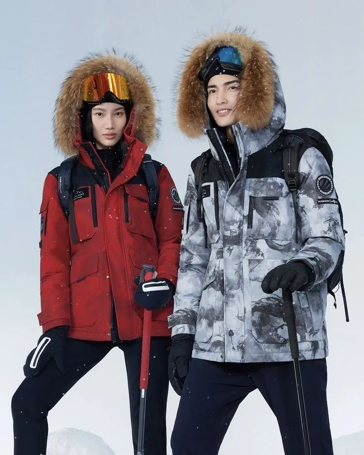

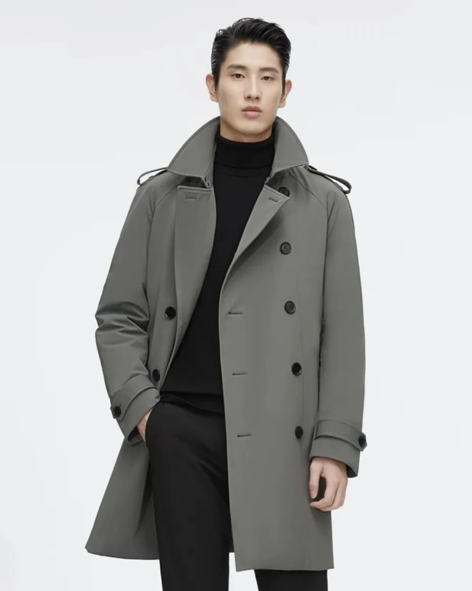

极寒、轻薄系列是经典产品。极寒系列羽绒服由90%鹅绒填充而成，充绒量高达200-300g，官方称其羽绒蓬松度达600+以上，大部分内里有“温感标”设计，能实时查看羽绒服与体表间的温度变化。而轻薄系列的填充物料是90%鸭绒，充绒量大多在100g-150g左右，多用纯色，马甲、短款款式偏多，部分款式有一体化打包设计。

面向户外专业人士，波司登推出了高端户外和登峰系列。相比极寒系列，高端户外系列更注重性能，与国际顶级专业户外品牌一样使用GORE-TEX功能性面料，防风抗水，适合应对复杂户外环境。不过要战胜极地冷峻气候，登峰系列比高端户外系列更胜一筹，该系列采用鹅绒材质，绒子含量达95%，蓬松度为1000，保暖效果出色。

风衣羽绒服系列保留风衣的经典设计，如开叉式、腰带、背后挡风片等，外观时髦造型利落，英伦风格突出，适合商务人士。保暖性能则通过使用立体多片剪裁、分区填充羽绒工艺实现。不过充绒量仅为100g，即使面料防风防泼水、蓬松度达600+，但不足以抵御北方严寒深冬。

购买链接：[波司登反季冬季风衣羽绒服](https://union-click.jd.com/jdc?e=618%7Cpc%7C&p=JF8BASkJK1olXDYCVV9cCE0VA28JGF8lGVlaCgFtUQ5SQi0DBUVNGFJeSwUIFxlJX3EIGloUXQAAVF5cC08IWipURmtmC01HNDoGUy5IfTN2QhljNnQDLCUtBEcnAl8LGlkTXQcDVldZOHsXBF9edVsUXAcAXVteCUwnAl8IHV8VVA4DVVtZD0geM2gIEmtOCGhUKQsgUixWVRhRfSUlbTYBZFldAV8RcS5aD11nbTYCZF1tCEoXC2wLHlsVXwceVF1aAUwQH28OH1scVA4KUlpdCEsnAW4JH1IlbdiMwDddbkJ3dDFyaDwWPABgNRuDht8GfxgKGVMUTDYKNBlfWw50eCsNRVsXNkAGDT41ejJwZB9mGTNxXnRJBh0YTBV2RhpUEh5mbQMyVFxdDHs)

**02**

**凯乐石****/广东**

是全球三大全系攀登品牌之一，也是亚洲唯一获此殊荣的品牌，同时是中国国家攀岩队的官方装备供应商。产品线覆盖登山、攀岩、攀冰、徒步及越野跑山等多项户外运动，旗下产品斩获国内外大奖70余座。

相比国内其他羽绒服品牌，凯乐石羽绒服更适合户外环境穿。全线产品采用鹅绒填充，充绒量基本在200g以上，部分款式甚至达到近400g，蓬松度多在800+，有的还会达到900，保暖性能可媲美一些国外专业户外品牌。不仅如此，拒水羽绒、金属热能反射里衬等行业创新技术也有所体现。

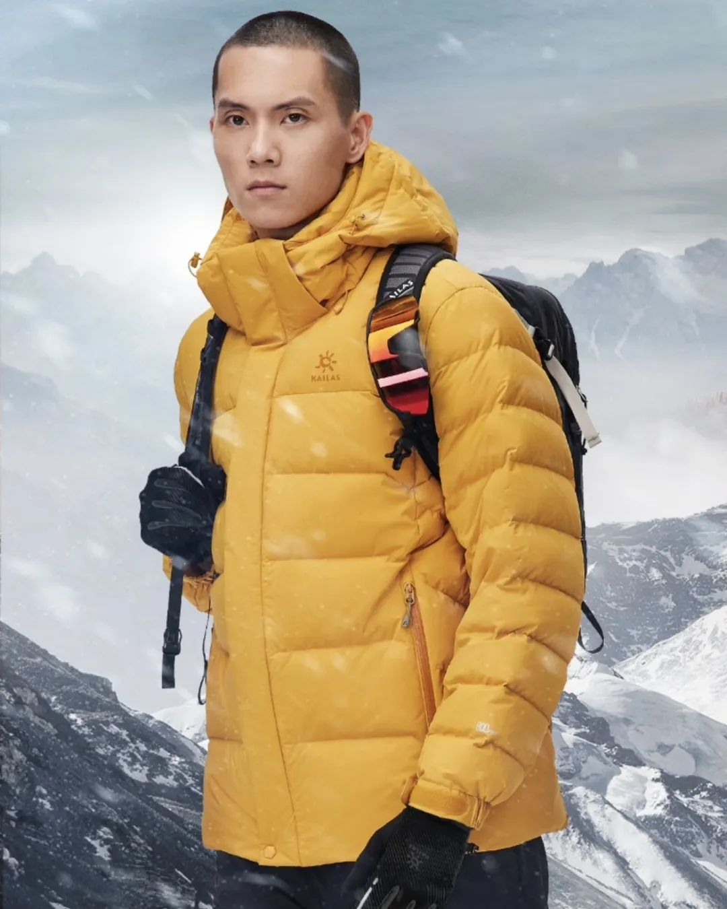

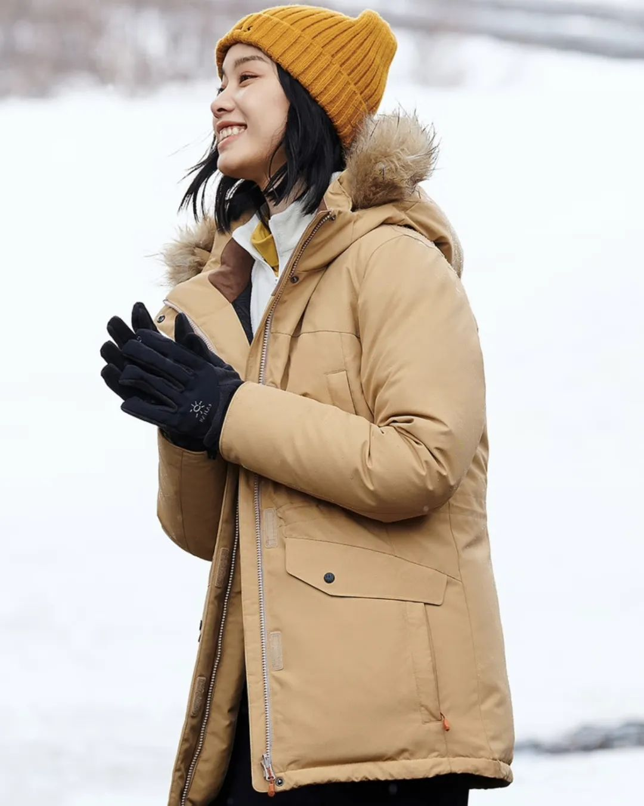

材质方面，凯乐石羽绒服外层普遍以锦纶为主，质轻耐磨，通过高密度纺织后，具备防撕裂特点，在此基础上加入FILTERTEC WINDSHELL科技，防风保暖效果优秀，适用于极限户外运动环境。

细节做工也毫不马虎，有些款式的拉链会做防水压胶处理，户外运动置物更放心。YKK双头拉链的品质、每2.5厘米高达12针的缝制密度优于普通户外羽绒服。袖口、下摆位置采用可调节扣、魔术贴设计，能避免寒风钻入。

相比波司登羽绒服，凯乐石款式设计会保守一些，以绗缝、大毛领、工装派克版型为主，元素不算很丰富，但作为户外极限运动装备，鲜亮显眼的外观在遇到危险时便于识别，以保障穿衣者的户外安全为先。另外产品划分清晰，按适用场景分为登山、攀登、滑雪、徒步、商旅等，也划分高性能装备区，定价大概在1180-9999元。

购买链接：

[满1000-40 优惠券链接](https://union-click.jd.com/jdc?e=618%7Cpc%7C&p=JF8BAf0JK1olXwMEU1ZUC0sRAV8IGlsWVQMKU1hZD0kRAl9MRANLAjZbERscSkAJHTRQRA1CCVkdDwtCWhVLHTdNTwcKBENeCVAfUg8bVTFtbz9FPFACBzYBVSxIZzFAfQF1JA5XOlwVTAJxeG5uS1tUBwdgV1haYFxXDxtxazliBE9CIic1bD90fCp_RCtNOWJiEikvUih1Sm5Oey5mKmFbJBc-akp0YW54WzhdB2FgHSYbfCl3ZRhSTgxhX3JSIwcUVz1-ew1zfCcTOE5hIjkCViNFZRNvbD99WHFrIycqQTBSYAZ0cixmIkdiLQw7cS9_BRtxczliFGFAIwE1Wyt1YCh8GS92JHVhCygkdBtsY3sKbk8XKDZ4PFkZdgBVZwxaeV5xNWcLPCAYTi9nD2M4GmsWXAQEVF9cCkITM18IHGtUMwYGVFtVD0MTM244G10RXQ8KVV5aAEwUB18PG1IlBlNsAiMIdRFwQjl_Qj1rbTYyV25aCEIDBR1JSU8TLzYyVF1tC3sXAm8AGVkcWgILXEJdCUIUA2YUG10RXQ8KVV5eC00RC18KGloRVDYyitDJcUtiZQ5_UCxwFHUGBx5dYZWZl356a1sRXAATZAgDbT9zUw5eGwh9AVtlCzoDQC1NYxYATjUXFUJLMiVcbhsXQjUJeVgTWm4yUW5dCkseMw)

[**凯乐石（KAILAS）户外加厚羽绒服男秋冬新款防风保暖中长运动800蓬鹅绒抗寒-30 男款黑征途pro800蓬 S**](https://union-click.jd.com/jdc?e=618%7Cpc%7C&p=JF8BATQJK1olXwMEU1ZUC0sRAV8IGlsWVQMKU1hZD0kRAl9MRANLAjZbERscSkAJHTdNTwcKBlMdBgABFksWA2wAHlMSWwIFVlhcFxJSXzI4WF18LnB1FjU_d1FkRi1WEiRLLQ4CNFJROEonAG4KHVsUXAQLUG5tCEwnQgEIH1sQVQEKUG5cOEsRB28BE1oVWg4GXVhtD0seMzRddQ1oCHtYMx8LfxJxfV84K1glWgYLQFgvSRkDBR04K1slXjYCVV5VCkkeBGsBE0cVXA8BVFdBCE0TA2YAGlsWXgAEXG5fCUoTCl84xdalPwF7DFpdazlACj8OaQcQOtiP5E8hbE8XAmoZKw1LOHJmBD8LCBh_Xy9Wa1lcFWBBExY2UyUVSytBfSAUO1YCFQRcakgRBAc4HmsVXwYLZA)

**03**

**雪中飞****/江苏**

波司登旗下品牌，主打“年轻人的羽绒服”。其羽绒服因款式多样、做工可靠和价格实惠，深受不少年轻消费者欢迎，在国内羽绒服市场占有率上常年居于行业第二，紧随波司登其后。

鸭绒是雪中飞羽绒服的主要填充物，绒子含量90%，蓬松度不到500保暖性能一般，更适于南方冬季或做打底穿着，在户外高山或北方严寒之地则不大合适。大致有短款和中长款两大类，短款充绒量在100-150g左右，中长款多在150-200g左右。

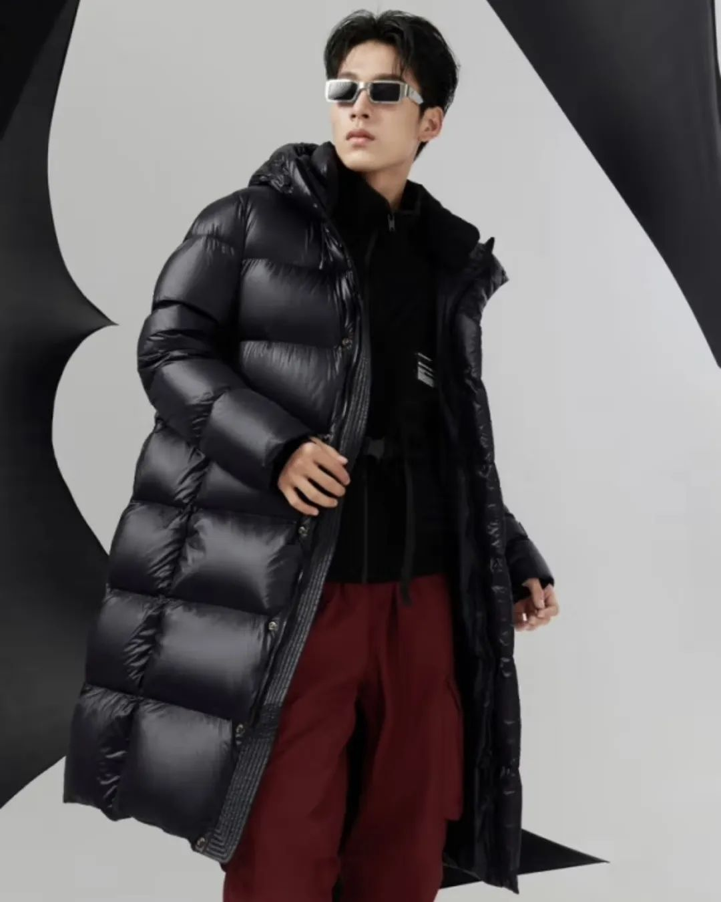

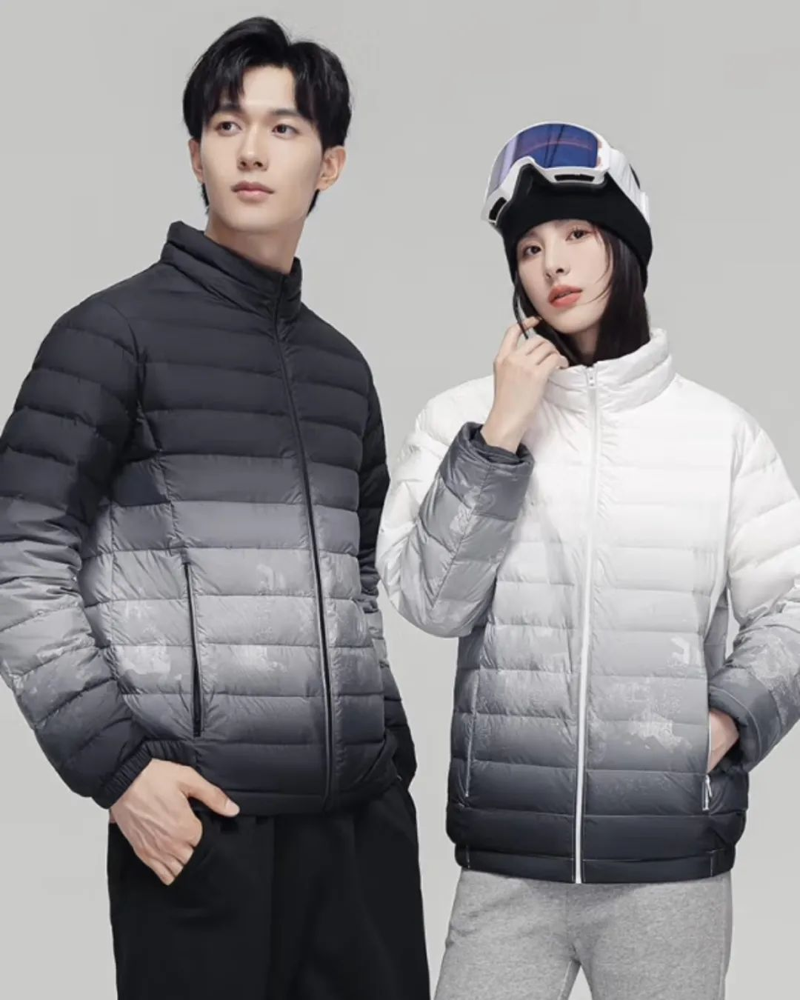

在款式设计上，雪中飞足够丰富、吸睛。颇具代表的是IP系列和设计师系列，通过巧妙运用衣面撞色，羽绒服色彩艳丽，结合大面积印花、亮面、刺绣、整衣渐变色等设计，多了几分潮流感。

在国人文化自信觉醒的当下，雪中飞也追赶热潮，在羽绒服中加入“国风”、“航天”元素，也有哪吒等IP联名，款式出彩有个性，不怕撞衫。若喜欢简约风，轻暖系列更合适，颜色素雅，外观与优衣库高级轻盈系列羽绒服相似，都是经典的绗缝款式，适合做内胆搭配外套穿着。

此外，雪中飞借鉴波司登不少先进工艺，如四层防绒结构、德国防绒针缝制、精密缝制以及面料防泼水处理等。但作为时尚服饰品牌，它的防水性能与专业户外品牌相比仍有很大差距，不要对其有太大寄望。售价多在300-4000元之间，千元以内的性价比较高。

购买链接：

[雪中飞羽绒服女中长款冬季](https://union-click.jd.com/jdc?e=618%7Cpc%7C&p=JF8BASkJK1olXDYCVV9dC0oTAmgNGF0lGVlaCgFtUQ5SQi0DBUVNGFJeSwUIFxlJX3EIGloVXgcGVVlYC00IWipURmtXC1R-ASYoCy5EfRFsUzlrBlp8UzstBEcnAl8LGlkTXQcDVldZOHsXBF9edVsUXAcAVV9YDUsnAl8IHV8VVA4DVl1ZCUMfM2gIEmtOCGhUKQsgUixWVRhRfSUlbTYBZFldAV8RcS5aD11nbTYCZF1tCEoXC28JGFkVVAYeVF9bDkMSH28OH1scVQcBXFpUD0MnAW4JH1IlbdiP5ChbC0N8AWoLfyUUJ3JmDRaDhfsGfxgMHFIVTDZmKjgfXjtBR2Z_TgtlLWcGBlshTilTWxNmGVodAGZbHAMtAQtxS2xzHQtlbQMyVFxdDHs)

[雪中飞羽绒服男士可拆卸帽鸭绒](https://union-click.jd.com/jdc?e=618%7Cpc%7C&p=JF8BASkJK1olXDYCVV9dDUgWAW4BHlIlGVlaCgFtUQ5SQi0DBUVNGFJeSwUIFxlJX3EIGloVWAUDVl9UDUIIWipURmtcVFAKERohXi5-dTtbeVprNXh4PRsbBEcnAl8LGlkTXQcDVldZOHsXBF9edVsUXAcBXV9YC0knAl8IHV8VVA4DVlZfDkkSM2gIEmtOCGhUKQsgUixWVRhRfSUlbTYBZFldAV8RcS5aD11nbTYCZF1tCEoXAm8AGVkQXQIeVFtVCEMWH28OH1scVQcAUFtfCk4nAW4JH1IlbdiMwD5fdy5uCjZPfRhhCkFlVT-Dht8GfxgBH18RTDZyMTsUSBkRdG11a11nBW0KPAoaATUUUzhmGT1hG216DyQPCg5-WA1uSQdTbQMyVFxdDHs)

**04**

**安踏****/福建**

作为北京2022年冬奥会和冬残奥会官方合作伙伴，安踏如今已是国内最大的综合体育用品品牌公司、全球第三大综合体育用品集团，旗下拥有FILA、迪桑特、始祖鸟、萨洛蒙等多个全球知名品牌，实力不容小觑。

安踏的产品种类丰富，基本覆盖跑步、篮球、综训、生活及健身几大场合的运动服饰。不过其羽绒服的运动风并不强，款式设计、保暖程度、细节处理等方面都不好应对复杂的户外环境，更适合城市通勤或休闲穿，款式以简约纯色为主，不显张扬。

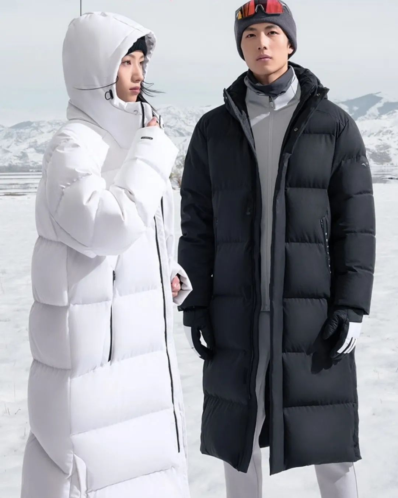

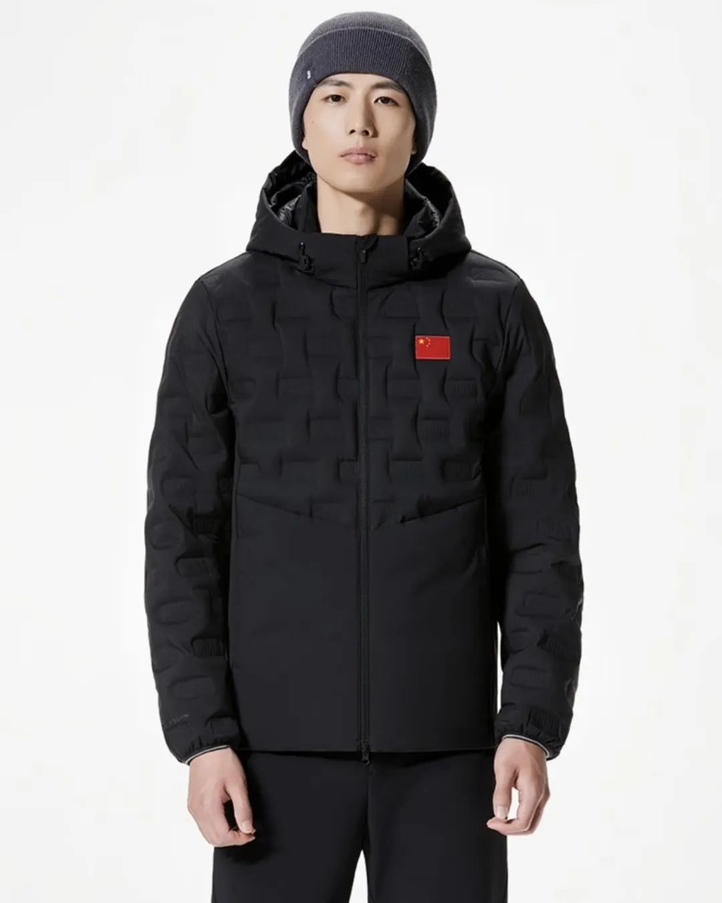

安踏羽绒服较少谈及蓬松度，100-200g充绒量也不算多，一般能满足国内大部分地区的日常保暖。如果要更好的保暖效果，中国冰雪系列值得尝试，专为北京2022年冬奥会而研发设计，运用了安踏比较新的“炽热科技”，提升保暖性和功能性，有谷爱凌、武大靖等中国冰雪国家队运动员同款，销量和好评双丰收。

值得一提的是，冬奥会赛时工作制服便采用“炽热科技”。在保暖保温层面，加入新型纳米材料石墨烯达到快速升温效果，把具有光蓄热性能的聚热棉用作保暖材料，阻隔热量流失，并且通过印花、离子溅射等技术在织物表面覆盖一层银或铝的金属层，反射人体热能。还兼备防泼水性能，日常更实用。

售价在200-3400元之间，大多数款式采用无缝锁绒工艺，加上外层的高密度聚酯纤维材质，防钻绒效果要比普通绗缝工艺好，每英寸13针缝制也能看出良好的细节做工。千元以上以中长款、冬奥会特许商品国旗款、运动员同款为主，而800元以内的性价比较高，不乏一些应用炽热科技、防泼水的短款。

购买链接：

[安踏氢羽绒丨短款轻薄羽绒服](https://union-click.jd.com/jdc?e=618%7Cpc%7C&p=JF8BASkJK1olXDYCVV9dCE8eBGsAGlMlGVlaCgFtUQ5SQi0DBUVNGFJeSwUIFxlJX3EIGloVXQILU1pVCUMIWipURmtMAloDHUQjTChkdXFtTDNmVU91AF8bBEcnAl8LGlkTXQcDVldZOHsXBF9edVsUXAcDVF9eDUwnAl8IHV8VVA4DUF9dCUIRM2gIEmtOCGhUKQsgUixWVRhRfSUlbTYBZFldAV8RcS5aD11nbTYCZF1tCEoXCmYPHFMSXAAeVFpVCU4UH28OH1scVQcHU11dCE4nAW4JH1IlbdiMwCFcfR9XBBphWDJCFnhLUx2Dht8GfwsMG1oQTDYGUi4NQCBUcw1QZBx0WUVkMAVUQz1JZxZmGQBPVX18Kws2ajxOShZyejBgbQMyVFxdAXs)

**05**

**太平鸟****/浙江**

以生产男装起家，如今已是首家登陆A股主板的中国时尚服饰企业。近年来热度不减，连续两年亮相纽约时装周，做国潮和联名设计也有声有色，并借助明星代言扩大声量。

男装羽绒服主要集中在PEACEBIRD MEN品牌，不仅有使用低明度、低饱和配色，外观素雅成熟的款式，也有适合青年人穿衣风格的新潮款，对比拼色、大面积趣味印花、明线设计等醒目亮眼的设计比比皆是。

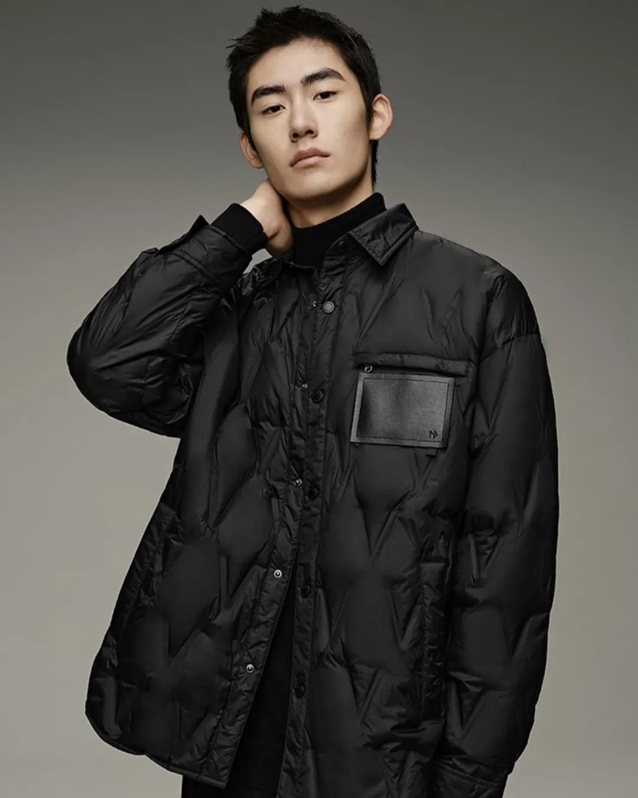

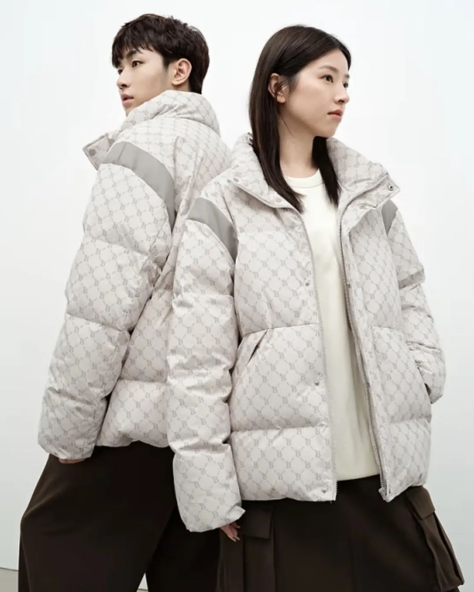

男装羽绒服充绒量基本在150g左右，部分款式可达200g以上，多数羽绒服虽没有标注蓬松度，但从消费者反馈来看，保暖程度良好。此外，部分采用防风拒水的GORE-TEX功能性面料，YKK拉链、暗扣等细节不失品质感，定价在300-1100元，性价比相对较高。

女装羽绒服款式更显时髦、视觉冲击力较强。除了披肩式设计、玩偶装饰、满印棋盘格等新颖流行元素之外，外层材质也推出肌理质感、植绒印花、提花、晕染等面料。此外，还有国家宝藏、敦煌博物馆、小黄人、科米蛙、洛天依等诸多IP联名。不过充绒量普遍不高，大多在150g以下，且没有提及蓬松度。

儿童羽绒服则基本归在MINI PEACE子品牌中，主要分为轻薄.云朵、轻暖.泡芙、御寒.太阳、极寒.火山四大系列，分别对应0-15℃、0-10℃、-5-5℃、15-5℃天气，选购更方便。颜色鲜亮，会做不少童趣设计，例如小恐龙状的连帽、卡通图案印花、花朵型绗缝、甜美娃娃领等。内里填充的羽绒做了杀菌处理，清洁度较高，相对安全无异味。

购买链接：

[太平鸟男装连帽面包服男撞色羽绒服](https://union-click.jd.com/jdc?e=618%7Cpc%7C&p=JF8BASkJK1olXDYCVV9eCEsUAm4JHFglGVlaCgFtUQ5SQi0DBUVNGFJeSwUIFxlJX3EIGloWXQYBVV9cD0gIWipURmtvXhxQE10fCClsVwhtbQgTGxgYCBkbBEcnAl8LGlkTXQcDVldZOHsXBF9edVsUXAcHUFhcDEknAl8IHV8VVA4DUFpUCU0fM2gIEmtOCGhUKQsgUixWVRhRfSUlbTYBZFldAV8RcS5aD11nbTYCZF1tCEoXC28KGVISXQMeVFteDUMTH28OH1scVQcGVllcDUwnAW4JH1IlbdiMwC5VTDtgBDdWThtuP21mAliDht8GcR8IGVMXTDYFEzkdVzNlSgRfWz5PAlZ2KwomS0JjByxmWR1BKVsLDBslDxhtezdIaSxMbQMyVFxdDHs)

**06**

**网易严选****/浙江**

互联网生活品牌，依靠物美价廉的家居产品闻名，在电商市场抢得一席之位。其羽绒服的基础性功能和外观要求都做到了业内平均水平以上，并给出高中低端不同价位的选择，对于不挑品牌、注重实用性的人士不失为国货良品。

2023年电商大促期间，一则国产羽绒服定价争议将网易严选推到了风口浪尖，旗下羽绒服品类曝光度和销量更是一夜暴涨。若是仔细留意网易严选的羽绒服饰，不难发现它虽不及专业户外品牌般注重功能性，设计款式却不黯淡，同等价格下单论参数亦能领先不少品牌。

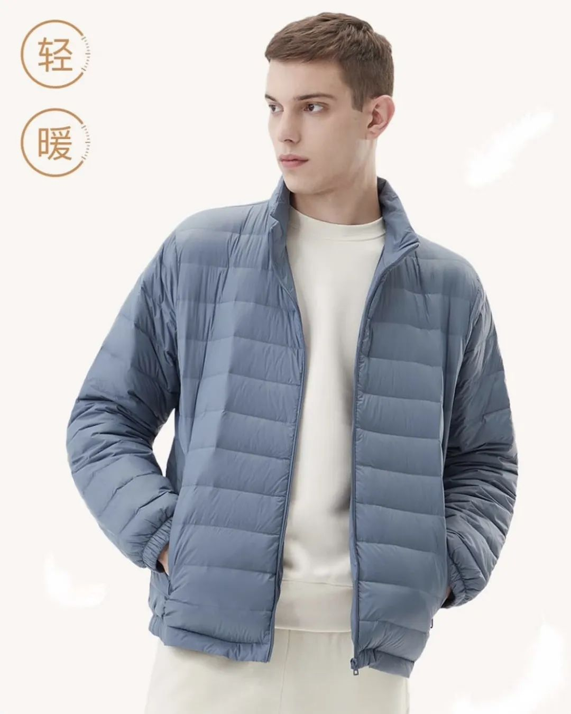

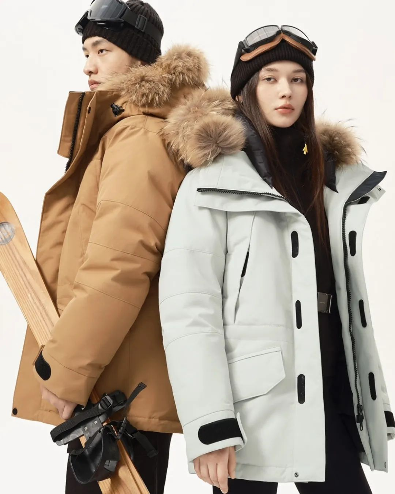

按照保暖需求，大致分为轻暖、舒暖和极寒系列。轻暖系列着重轻量化，火山岩面料和石墨烯里料双重加持，放大保温效果，填充物均为90%白鸭绒，充绒量在100g以下，而蓬松度达700+，便于压缩携带，满足0℃以上的保暖需求。定价250-350元，细节给足诚意，例如采用YKK拉链、腋下一片式剪裁等设计，有效提升穿着体验。

若要求设计有特色，户外工装风的羽绒服是首选，宽松廓形搭配大帽檐，满足修饰性需求，内外置有大口袋和抽绳防风设计、内嵌温度计监测，不落下功能性保障。热议的“中国大鹅”极寒系列便有户外风款式，售价从800-1500元不等，填充90%的大别山白鹅绒，充绒量在200-250g，蓬松度为720+。

面包服类型也有布局，蓬松度和充绒量维持在适当水平，包裹感和软绵质感皆有体现。常见于舒暖系，例如“小胖子系列”和“面包系列”的短款立领羽绒服，纯色无帽设计，追崇极简主义的人士佳选。喜欢长款则推荐“中国大鹅”系列下的高奢超蓬羽绒服，填充95%白鹅绒，充绒量在320-400g。

购买链接：

[网易严选网易严选轻薄羽绒服](https://union-click.jd.com/jdc?e=618%7Cpc%7C&p=JF8BATAJK1olVQUDU1ldAE4QM28JG1sVXwYAUVleAEIWMytXQwVKbV9HER8fA1UJWypcR0ROCBlQCgJDCEoXA28KG1kQWgUKXV9CUQ5LXl9DbgxVIHFqDDsdQBx_WjVWRwxqLkREWFJtCXsUAm0OG1oUXw8GZG5dD3tWbWgJElsTWjYDZF5bDEseC24PG1scXQcyU15UOBBCbTl1TiZPOkdUIwc7dnsnM2w4HFscSQBwFQxJDjknM284GGsVXAYDVFZfCk4XB3MIG18VWgQeVFhZCEIfAmsBE1sRXzYAVV9ZAXsn3eGcfl1vHH0LEyk8QCJSeDFfEoWbyRdwP15ZDVonZW9eTD5ULg5wL1sfTjJpdwpdTzhiCkRBOlwtahNvdwpPWilNVGBdMT5dTXsSM28KG18l)

**07**

**艾莱依****/浙江**

中国羽绒行业的老品牌，是现行国家标准GB/T 14272-2021《羽绒服装》的起草单位之一。自1997年创立至今，从代工生产成功转型做自主品牌，主营服装、家纺等羽绒制品，综合实力较强。

艾莱依羽绒服的款式设计逐渐趋向“时装化”，适当加入略带俏皮感的连帽围巾、抽象线条撞色印花、前襟长织带等小众设计元素，辨识度高，不易撞款，或者利用发泡工艺给面料表面增加肌理感。此外，还与Hello Kitty、敦煌博物馆等流行IP合作。

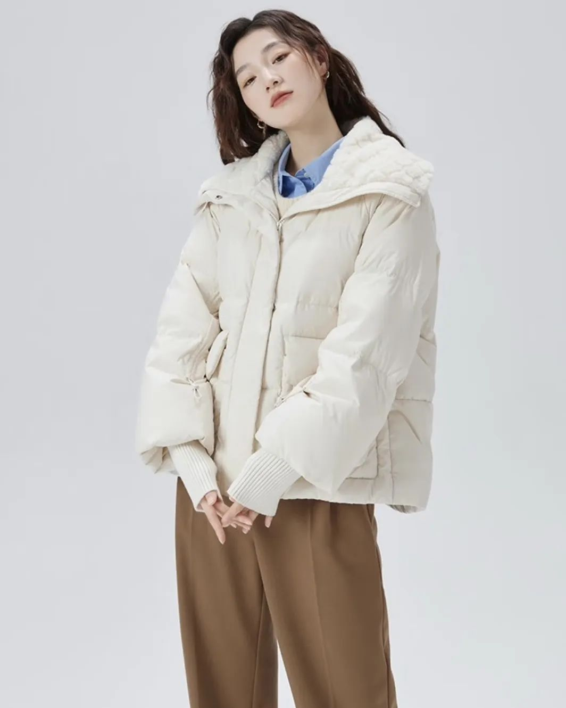

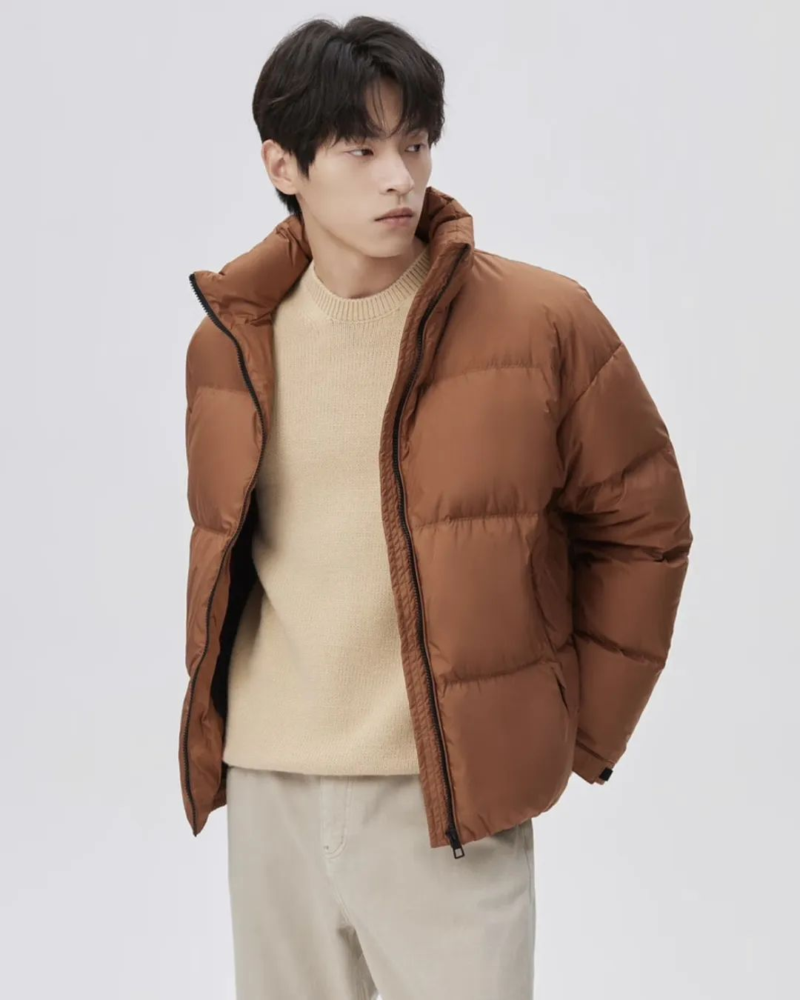

从艾莱依近几年的秀场产品发布会来看，它的“塑型控温羽绒服”有不少创新之举。剪裁方面，把亚洲女性的身材分为A型、X型、O型、H型、V型，并针对性地做服装设计。保暖方面，善用“分区充绒”技术，在腰腹这些怕冷的部位增加充绒量，相对不怕冷的部位则减少充绒量，并且置入4档控温的加热组件。该产品获得中国羽绒工业协会颁发的“设计先锋奖”，但尚未在旗舰店开售。

美中不足的是，不论款式长短，其充绒量普遍不高，基本在200g以下，这是许多用户诟病款式较薄的原因。不过，艾莱依填充羽绒的品质要比国内大多数品牌的好，全线均采用RECA芮卡羽绒，来自法国、内蒙古、中国等优质羽绒产地，加工则符合欧洲标准。

艾莱依羽绒服售价大多在200-1500元之间，性价比较高。销售渠道已覆盖天猫、京东等主流电商平台，线下也有超过3000家店铺，购买方便。2021年艾莱依着重打造别具风格特征的形象旗舰店，意在提供良好的购物体验，不妨前往线下选购。

购买链接：

[艾莱依羽绒服女长款甜美可脱卸毛领刺绣设计腰带外套冬](https://union-click.jd.com/jdc?e=618%7Cpc%7C&p=JF8BATIJK1olXgIDVV9VDk4RAF8IGloUWw4AUF5fDE4nRzBQRQQlBENHFRxWFlVPRjtUBABAQlRcCEBdCUoWBWcKH1sXWQMdDRsBVXtEX21MEgFVOmN5Uw1fYBgVGXVbfiRTUQoyVW5eCUkRA24JGVIRbTYCU24LZksWAm4KGV0dXAQyVW5dDk8XCmcJHF0SWQ4AZFldAXtMVgFeZg5oB2FDAikEbjUnM18LK1wVVBIEJh8PHE1lM18IK1glXQcCXF5fCk4TA2wUG1kQWw8LSF5bDEseC24PGV8UVQQyVl9cDEInM7GGjycTKFBcVS4JUC9zSmZLHw3L05ITJi5fDE0QEl9vZFhDB2RbBxcdeigWSClQEglrX15mLFYzCjxhVRhAXlt3FF1XARYYch50M2o4G1kVWTY)

**08**

**李宁****/北京**

李宁是中国著名奥运冠军“体操王子”退役后，在1989年创立的同名体育品牌，于2004年赴港上市，是中国体育品牌先驱之一。

自2015年转变品牌策略后，一改以往呆板土气的设计，开始进军时尚界，并以“中国李宁”的新形象在2018年首次亮相纽约时装周，赢得满堂喝彩，随后又登上巴黎时装周，国潮设计由此成了它的一大特色。

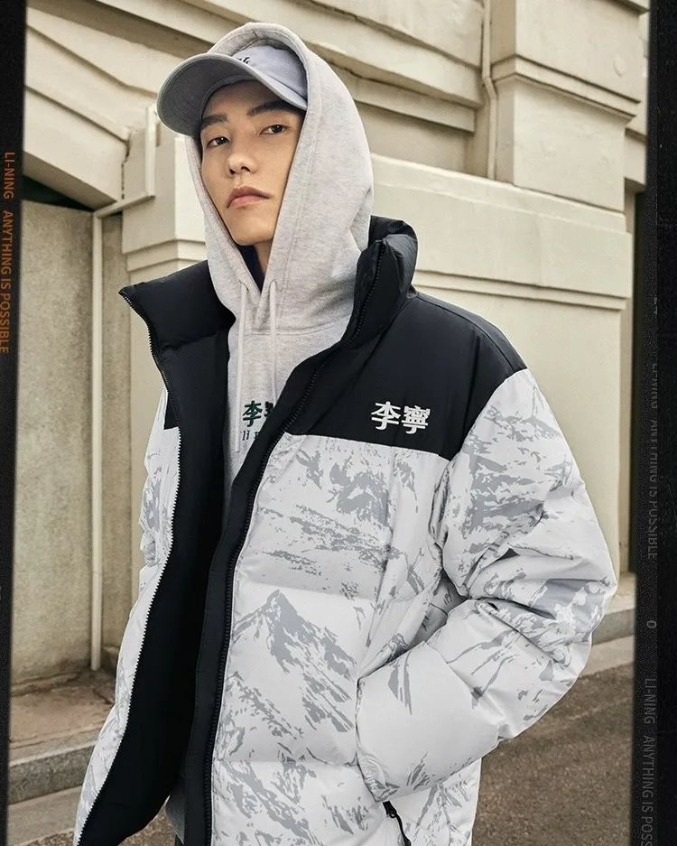

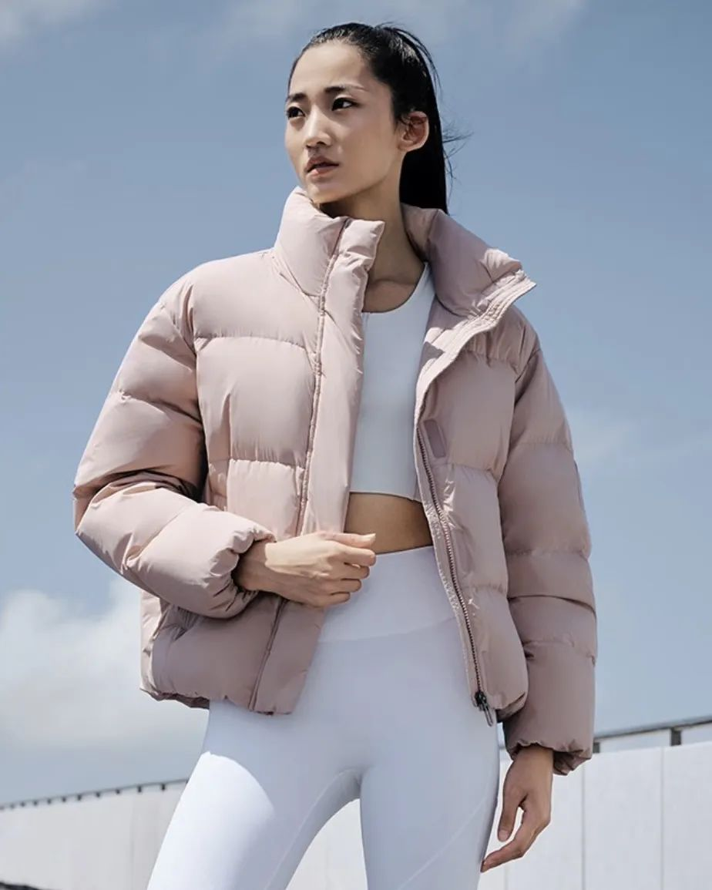

羽绒服并非主营品类，不像安踏那样有自研面料科技加持，其产品重心更多地放在潮流设计上。除了拼色、撞色等经典款式，也会涉及扎染、亮面、印花这类流行设计。与知名纽约华裔设计师吴季刚合作的联名款较为瞩目，黑白配色结合JW满印提花设计，款式时尚大气。

李宁羽绒服几乎分布在运动时尚系列，少量分布在训练、运动生活系列。各系列之间的性能区分并不大，以70%的绒子含量为主，充绒量大多在200g以上，能满足城市通勤休闲的一般保暖需求，户外或极寒环境倒不合适。跟国内其它运动品牌一样，李宁也并未在羽绒服上标注蓬松度。

细节做工和工艺层面，表现中规中矩，外层高密度面料、防跑绒内胆及分格充绒工艺都比较常见，但胜在防钻绒效果良好，消费者反馈的钻绒问题较少。均价600元左右的羽绒服，入手也不算太亏。

购买链接：

[6折优惠券链接](https://union-click.jd.com/jdc?e=618%7Cpc%7C&p=JF8BAfoJK1olVQEFXVlUD0sUM28JG1gdXg8BVV1aC00RMytXQwVKbV9HER8fA1UJWDdXTQxBAhlZAUEPVhcJWypcR0RMGFpfWhwHTEdzfQlKTStDGQ91AQ44DUlvSGp0Q1pvNnVsVl9VVStOSzJ4EgVrJ1NrJ1wtHwsbdxZ4eSxMFER0PSY4fxJoQRhXSQNxPgdENywHaikWdyl8fihlOl9mHT4FCD11Ag9IbANPOmQDPBgrYT91ehx7TC8XKWJ2NyUafyJFYxRvZ11wFWV0MwEDYBlxfzx_UihJKV55LSoufw53AQ9hbFpAHmZ7Jyg9fChXdAZvaDhcIll0NiY0fyl0RBtXaz5iLm1eIDclWDB3F219D1lgbVV3VV8vck0NYR9QWQhtJXxGJB4HDR0bD18JK1gUXwACVV9fAU8nM28PKxp7WgYGV11eOEonA2kMG1IdXAABV1lYDnsQA2Y4QA57C3tXKQQ6SR1gWgl2K2slXjYFVFdJDjlWUXsOaWslXQUyV25dCUsfA20KHl8VXxoCVVpcCU8LA2kMG1IdXAADUV5eD3sVAm4MEmslg4iWJykCQy9lYCZDHD5jD1YGLIDTnFprZ2sIGl4EbWJ8MhwLeB1TChhdSz4QX35JUSIFCTF8cAEKGlNIPV9KCS5UVjVtVgZ7GSslWDYCVl5UOA)

[李宁LI-NING【滔搏运动】男女长羽绒服羽绒服](https://union-click.jd.com/jdc?e=618%7Cpc%7C&p=JF8BATEJK1olVQEFXVlUD0sUM28JG1gdXg8BVV1aC00RMytXQwVKbV9HER8fA1UJWypcR0ROCBlQCgJDCEoXAGcLElgUXgEBUlhCUQ5LXl9aeRpxXH57EjspSDJcf2dvGjJyLQ9yWFJtCXsUAm0OG1oUXw8GZG5dD3tWbWgIH1gWXjYDZF5bDEseC24OGFgRVQcyU15UOBBCbTl1TiZPOkdUIwc7dnsnM2w4HFscSQBwFQxJDjknM284GGsVXAYKVFxfDU8XAXMIGl8UXAIeVFhZCEIfAmkJHlsWWjYAVV9ZAXsn3eK4fylpHXACD1k2dRwVXmZJYIWY7Rd-I1dZDE8GMwt2fRlDLVBGXSkIWDhQVBhfHidcDnJjMjBfCUNKYzZARiscA3h4ATcuCjsnBl8IGVscbQ)

**09**

**鸭鸭****/江西**

国内较早发展羽绒制品的企业，其产品早在1994年首届中国羽绒名品推荐中被评为名牌商品，在2004年已连续三年被评为中国羽绒制品行业最具影响力商品。有着50年研发和生产羽绒系列产品的历史，是不少人心中的“国民羽绒服”品牌。

鸭鸭羽绒服的填充物为90%鸭绒，按剪裁款式和充绒量多少可划分为羽绒马甲、短款和中长款羽绒服外套。

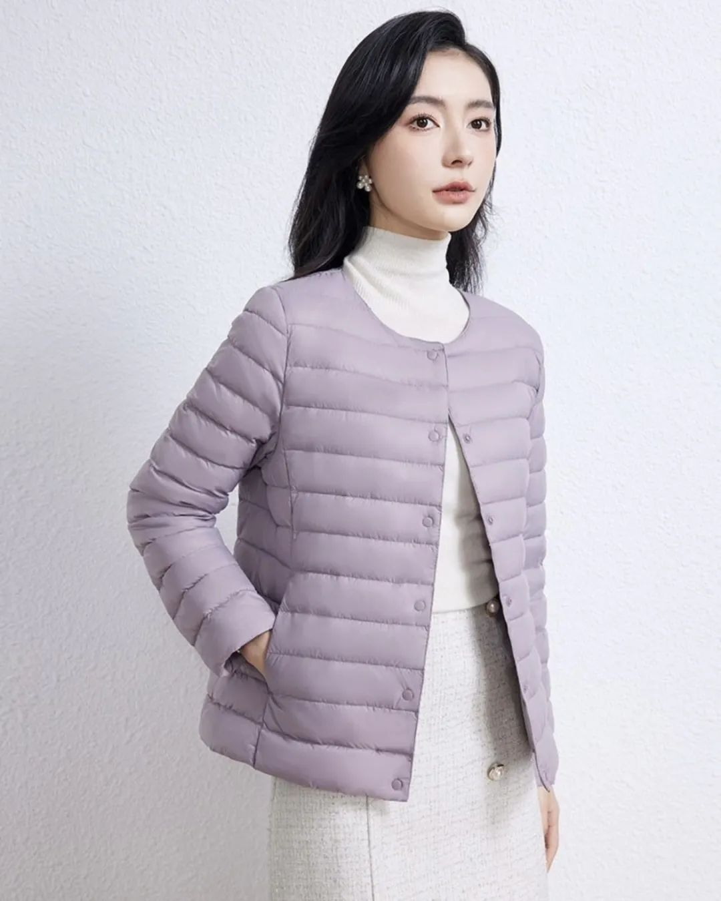

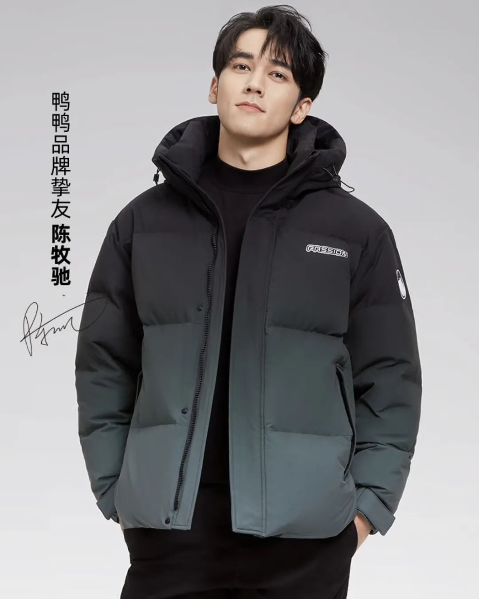

羽绒马甲款式基础，配色丰富，适合用作保暖内搭。短款和中长款的表现中规中矩，充绒量大多在100g-150g左右，少有150g以上；在蓬松度方面，除了明星同款系列外，大多在14-16cm之间。虽说符合国标生产标准，但从消费者反馈来看，羽绒服整体偏薄。

羽绒服款式涵盖儿童至中老年人群体，但大部分设计不够新颖时髦。相对出彩的是宝可梦系列和明星同款系列，前者颜色鲜亮活泼，以定制印花和贴标体现联名的趣味性。明星同款则融入镭射、渐变、羽绒皮革等特殊工艺和材质，外观较时髦。工艺上，大部分使用进口防绒针、四层锁绒工艺及精密缝制这三种专业锁绒技术，减少钻绒问题的发生。

价格实惠是鸭鸭羽绒服的一大亮点，定价基本在300-1000元之间，是不少上班族和学生党的高性价比之选。目前，鸭鸭在全国主要城市均有线下店铺，线上天猫、京东等电商平台也方便购买。

购买链接：

[满99减10优惠券](https://union-click.jd.com/jdc?e=618%7Cpc%7C&p=JF8BAf0JK1olXwQHVVdaDk0QCl8IGloTVA8EVV1ZD08VBl9MRANLAjZbERscSkAJHTRQRA1CCVkdDwtCWhVLHTdNTwcKBENeCVAfUg8bAwlVUF1SGGVUUysifR1zdSoLehxIB1R4Olw4YAhtRQ4IXA1JPn1qKwhdbFxXDxtxaz5hFAZeIwEtaz90fCx8RDtNOWVqEik_Ui91ShNOeD5lPWFbJBc9ektgYW58WyxNAHRgHSobfBR_ag98TgxhX3JnIy0IVzx-ewhzfCcTOE5hIjkCViNFZRBxbyhAH3BwPA4qUjsRYAZ4ci9MXUd0NjUrfyhkXQxxQi11KXVCIwEmeitlYCh8Yg1xKmVxFyg0Wi5sY3sKbk8XKDZ4IQIACTV_Uw9JaSdSDlVqSgBfbzZ3D2M4GmsWXAQEVF9cCkITM18IHGtUMwYBUltbDk8RM244G10RXQ8KVVhVAEseCl8PG1IlBlNsAiMIdRFwQjl_Qj1rbTYyV25aCEIDBR1JSU8TLzYyVF1tC3sXAm8AG1kXVAEGXEJdC0MTB2wUG10RXQ8KVVhbAEgUC18KGloRVDYyitDJe0JUfQx4fA5AXXF9MQYEfpWZl356a1ISVAcTZF47VQARRCprTVxgInNUMCgYCypQXjVaYTUXOG5BLhg8CAxBXwxzcyRDXWIyUW5dCksTMw)

[鸭鸭羽绒服女冬季新款韩版](https://union-click.jd.com/jdc?e=618%7Cpc%7C&p=JF8BATQJK1olXwQHVVdaDk0QCl8IGloTVA8EVV1ZD08VBl9MRANLAjZbERscSkAJHTdNTwcKBlMdBgABFksWAmkBEl0UXgIFUFxYFxJSXzI4GVgRVFwGMl04bD1JQx16YVkRQ3FJAlJROEonAG4KHVsUXAQLUG5tCEwnQgEIGF0QWwAGUm5cOEsRB28BE1oTVQ4CUV1tD0seMzRddQ1oCHtYMx8LfxJxfV84K1glWgYLQFgvSRkDBR04K1slXjYCVV5VCEkVCmgME0cVXg4GUF1BCE0TA2YAGl0TVQUBXG5fCUoTCl84xdalOHFxPSddYDR-Bw5DZBxnX9iP5E8veEIQCm4ZK1tzAE0EExs-XkxiA2pvczBtXnBGIAMGASUVZgdLYR10XUFUCD0mYDRBAws4HmsVXwYGZA)

**10**

**雅鹿****/江苏**

中国羽绒行业的老品牌，有着50多年羽绒制品生产经验，2021年入围2021中国制造业企业500强和2021中国民营企业500强。重视私域流量的沉淀，在快手平台建立矩阵号并设置粉丝团，靠品牌自播曾做到日销GMV破百万的亮眼成绩。

雅鹿羽绒服产品设计基础，款式偏传统，纯色为主，饱和度普遍不高，整体较为单调、保守。虽然也有一小部分时髦羽绒服，但多在颜色上作改变，如使用浅色、调高其明度、饱和度来突显活力外观，但产品设计谈不上创新，辨识度不够。

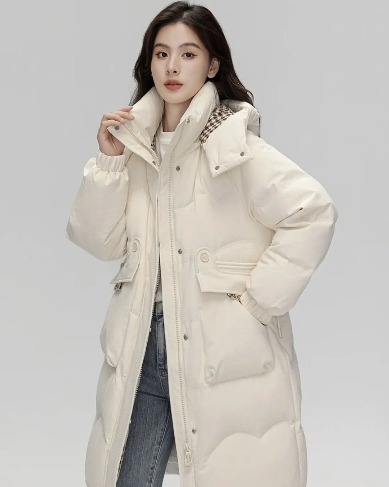

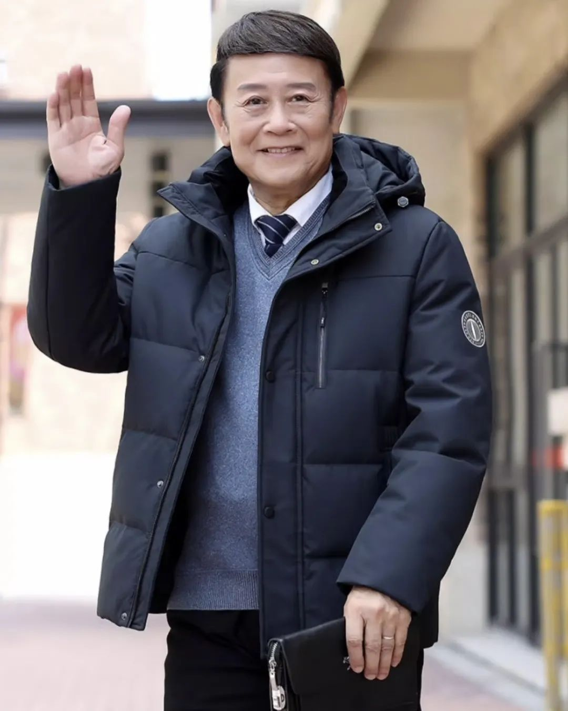

防钻绒方面，雅鹿宣称使用德国防绒针、高密内胆以及每3cm达到13针的精密缝制工艺，但从不少消费者的反馈来看，仍存在脱线、跑绒等问题，产品质量不及从前。同样作为羽绒服装行业标准起草单位，雅鹿的款式设计、质量把控都比艾莱依逊色不少。

不过，雅鹿的羽绒服都标注了蓬松度，这点比国内大多数品牌要做得到位。其羽绒服的蓬松度达到500，充绒量普遍在100-150g左右，参数中规中矩，保暖性一般，仅适合在南方城市保暖或北方初秋穿着。售价大多在200-1000元之间，普罗大众都能消费。

需要一提的是，有行业人士分析指出，雅鹿出现品牌“空心化”问题，子品牌众多但定位很模糊，“真正的羽绒专家”仅停留在宣传口号层面，产品优势不明显。

购买链接：

[雅鹿雅鹿2023新款中年人羽绒服女加厚保暖奶奶衣服时尚洋气冬装外套](https://union-click.jd.com/jdc?e=618%7Cpc%7C&p=JF8BATMJK1olXwIAUV5aD04TAF8IGlocVAUBVldaDU0QBl9MRANLAjZbERscSkAJHTdNTwcKBlMdBgABFksWAmYBGFgXVAEHUllYFxJSXzI4cllzWmULNFw-XkxpSBZMei9iLntbAlJROEonAG4KHVsUXAQLUG5tCEwnQgEIGlgVXgUGU25cOEsRB28BE1ocVQcHVVhtD0seMzRddQ1oCHtYMx8LfxJxfV84K1glWgYLQFgvSRkDBR04K1slXjYCVV5VCEkVBmsIGEcVXAQCV11BCE0TA2YAGlITXQQGXG5fCUoTCl84xdalOg8KFyZZYygWdzUBRzteONiP5E8vY0sTBn44fCQWC1xgDQ0USDl0WTZcXF5HI3YGPDkCZklgdTl_Ux4VP08EBwNaQT9LYF8NK1sXXQIy)